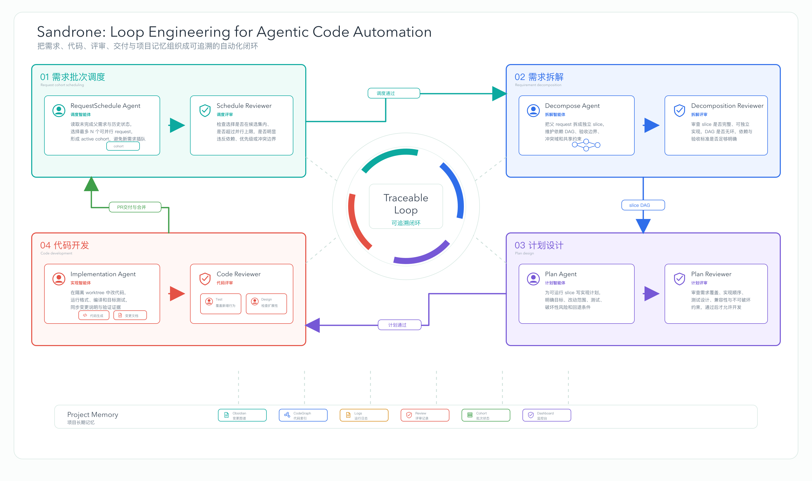

# Sandrone

`sandrone` 是一个面向 Codex 的自动开发外框架。它借鉴 **Loop Engineering** 的思路：不把 AI 编程当成一次性 prompt，而是把需求、代码、评审、交付和项目记忆组织成可观察、可恢复、可审计的反馈闭环。

它会把目标 Git 仓库放进独立 workspace，自动抓取需求，按 cohort 批次选择一组可并行父 request，拆分为可追溯的 slice，生成计划，隔离 worktree 实现，通过 reviewer gate 后进入 PR 交付与串行合并。每一轮都会留下 Obsidian 文档、CodeGraph 上下文、runtime 日志、review JSON 和状态记录，方便人类和后续 agent 接着工作。

这个仓库本身提供两部分能力：

- Rust CLI：`sandrone`，也可以用短别名 `sdr`。
- Codex Skills：`sandrone` 和 `obsidian-change-trace`，让 Codex 知道如何使用这套流程。

适合的使用方式是：让 `sandrone loop start` 长期运行，让 agent 写计划/代码，让 reviewer 严格拦截风险；人类主要在 PR、阻塞恢复、策略调整和关键交付决策上介入。



## 安装

### 依赖

| 工具 | 用途 |
| --- | --- |
| Git | clone、worktree、branch、push、PR 交付。 |
| Rust/Cargo | 从源码安装 CLI；Rust 目标项目默认格式检查也会使用。 |
| Codex CLI | 默认 agent/reviewer 后端。 |
| GitHub CLI `gh` | 默认 GitHub issue/PR connector 使用；内部平台可替换脚本。 |
| Node/npm + CodeGraph | 推荐安装，用于目标仓库代码索引和上下文生成。 |
| Obsidian | 可选，但推荐，用于打开 workspace 内的 `obsidian/` 变更图谱。 |

远程一键安装：

```bash
curl -fsSL https://raw.githubusercontent.com/ZhmYe/Sandrone/master/scripts/bootstrap.sh | sh
```

本地源码安装：

```bash
scripts/install.sh --force
```

安装脚本会安装 CLI、两个 Codex skill，并尽力安装/配置 CodeGraph。这里的 `--force` 用于覆盖已安装 skill；如果只想强制刷新本地二进制，可以运行 `cargo install --path . --force`。安装后建议重启 Codex App，然后验证：

```bash
sandrone --help
sandrone dashboard --json
```

如果普通终端找不到 `codex`，可以设置：

```bash
export SANDRONE_CODEX_APP="/Applications/Codex.app"
export PATH="/Applications/Codex.app/Contents/Resources:$PATH"
```

更完整的安装、PATH、代理、`agents/config/*.json` 模型/backend 配置、CodeGraph 和 Obsidian 配置见 [docs/installation.md](docs/installation.md)。

## 快速开始

推荐先在 GitHub 或内部 Git 平台创建目标仓库，再由外框架 clone。即使是空项目，这样后续也能自然 push 分支和创建 PR。

```bash
mkdir -p ~/Desktop/github/MyApp-auto-dev
cd ~/Desktop/github/MyApp-auto-dev

sandrone new --url https://github.com/<owner>/<repo>.git
sandrone loop start --interval-seconds 900 --parallel-limit 2
sandrone dashboard
```

如果只是本地原型，也可以创建本地空仓库：

```bash
sandrone new --name MyApp
```

让 Codex 介入时，可以直接说：

```text
使用 Sandrone skill，进入 /path/to/<workspace>。
先运行 sandrone loop start。
如果 blocked，先读 recovery.md、status.json、agent 日志和 review detail，不要绕过 reviewer gate。
```

## 流程

Sandrone 的核心不是一条超长流水线，而是 **cohort 批次闭环**。一次 active cohort 是一批最多 `parallel_limit` 个父 request；这批 request 内部并行推进，但不会被后续新需求插队。

一个 cohort 的生命周期：

1. **批次调度**：`tools/issue-update.sh` 抓取并去重需求。没有 active cohort 时，RequestScheduleAgent 选择最多 N 个父 request，RequestScheduleReviewer 审核后写入 `.sandrone/state/scheduler/cohort.json`。
2. **拆解与计划**：每个父 request 由 DecompositionAgent 拆成 slice DAG；可运行 slice 再由 PlanAgent 生成计划，并通过 PlanReviewer。
3. **代码开发**：ImplementationAgent 在隔离 worktree 中编码、测试、更新 change doc；format/check 通过后进入 TestReviewer 与 DesignReviewer。
4. **PR 交付与合并**：父 request 的所有 slice 通过后，loop commit、push、创建或复用 PR。PR 合并串行执行，每轮最多合并一个 `wait-finish` PR，且必须 `pr-status=safe`。
5. **PR 状态退回**：如果 PR 落后、冲突或平台检查不可安全合并，`pr-status` 会把对应 request/slice 退回 ImplementationAgent。修复后重新通过 format/check 与 code-review，再更新 PR。

核心原则：

- active cohort 存在期间，loop 只推进 cohort 内 request/slice/PR；只有 cohort 内父 request 全部 `finished` 或 `blocked` 后，才归档 cohort 并进入下一批。
- 每个父 request 会先拆成一个或多个 slice；小需求通常只有 `S01`。
- 每个 slice 都走 `plan -> plan-review -> implementation -> code-review`。
- reviewer 有 blocking finding 时必须退回修复；gate 不可用时必须 block，不允许绕过门禁。
- reviewer gate 和 agent 一样异步运行：loop 先派发后台 worker，worker 结束后由 hook 或下一轮 loop 收敛状态。
- active cohort 会写入 `.sandrone/state/scheduler/cohort-progress.json`。任一 request/slice 状态更新都会刷新该文件并写入 loop wake 文件；loop 被唤醒后继续推进，如果事件漏掉则按 `--interval-seconds` 兜底巡检。
- 如果同一 cohort 内某个 PR 先合并，导致另一个 PR 小概率冲突，后者会被 `pr-status` 退回 implementation/code-review；cohort 外新需求不会提前插入。
- 所有文档、review detail、agent 日志、状态和 PR 记录都写入 workspace，便于恢复和审计。

完整状态机、slice 调度、review 轮次、PR 状态退回见 [docs/workflow.md](docs/workflow.md)。

## 常用命令

| 命令 | 作用 |
| --- | --- |
| `sandrone loop start --interval-seconds 900 --parallel-limit 2` | 启动后台 loop；没有 active cohort 时调度下一批，之后持续推进该 cohort。 |
| `sandrone loop status` | 查看 loop worker 状态、pid 和最近状态。 |
| `sandrone loop run-once` | 前台跑一轮，适合调试 connector 或观察 cohort 推进。 |
| `sandrone loop stop` | 停止 loop worker，不强杀正在运行的 agent/reviewer。 |
| `sandrone loop stop --request_id REQ-0001 --reason "..."` | 主动把某个 request 标记为 blocked。 |
| `sandrone loop restart [--request_id REQ-0001]` | 恢复 blocked request；不指定 request 时恢复所有 blocked request，之后用 `loop start` 继续自动化。 |
| `sandrone dashboard` | 打开本机所有已登记 workspace 的监控页面。 |

内部 hook、connector 和测试仍会使用 advanced commands；普通使用不需要直接调用。完整参考见 [docs/commands.md](docs/commands.md)。

## Workspace 结构

```text
<workspace>/
  dev/
    repo/                 # 目标仓库主副本
    worktrees/            # 每个 request/slice 的隔离 worktree
  obsidian/
    project.md            # Obsidian 根导航
    codegraph/context.md  # CodeGraph 代码上下文
    changes/              # request/slice 文档包、review、状态、PR 记录
    derived/              # AI 友好的轻量索引
    views/                # Obsidian Bases 视图
    project.canvas        # 从 JSON 派生的人类观察图
  agents/                 # 各类 agent/reviewer/scheduler 的独立运行日志和中间产物
  tools/                  # 可替换 connector 脚本
  .sandrone/              # 机器索引、cohort 状态、事件流、锁和兼容指针
  .env                    # workspace 级运行时兜底配置
```

文档图谱规则很简单：`project.md -> 父 request index -> slice index -> 阶段总文档`。大段计划、实现说明和 reviewer 机器 JSON 不复制到 index；重要说明留在 Obsidian，日志、request schedule、review context、PR 安全检查、runtime JSON 等中间产物放在 `agents/<kind>/runs/**`。当前 active cohort 位于 `.sandrone/state/scheduler/cohort.json`，运行进度位于 `cohort-progress.json`，完成后会归档到 `last-cohort.json`、`last-cohort-progress.json` 和 `cohort-history.ndjson`。

更多目录和文档职责见 [docs/workspace-layout.md](docs/workspace-layout.md) 与 [docs/obsidian.md](docs/obsidian.md)。

## Dashboard

```bash
sandrone dashboard
```

Dashboard 会读取全局 `~/.sandrone/workspaces.json`，展示本机所有已登记 workspace。左侧按项目分组，右侧显示父 request 列表；点击 request 后可以在 `需求分析 | Slice 1 | Slice 2 ... | PR` 中查看需求拆解、各 slice 的计划/实现/review detail，以及父 request 的 PR 交付、PR 状态退回和合并状态。

详情见 [docs/dashboard.md](docs/dashboard.md)。

## 配置与扩展

- 每种 agent/reviewer 的统一配置文件在 `agents/config/<kind>.json`（当前 kind 包括 request-schedule/decomposition/plan/implementation 及各 reviewer；rebase/integration 配置仅作旧 workspace 兼容），可以分别设置 backend、model、reasoning、api_key 和 base_url。
- `parallel_limit` 控制每个 cohort 最多并行多少父 request；它不是全局无限队列，active cohort 未结束前不会调度新父 request。
- 运行时读取优先级是：shell 环境变量 > `agents/config/*.json` > workspace `.env` 兜底。不建议把 secret 提交到仓库。
- 默认 GitHub issue/PR 逻辑只是 `tools/*.sh` connector，可以替换为 Jira、飞书、内部平台或其他 LLM 后端。
- `tools/check-format.sh` 是 code-review 前置检查，默认 Rust 项目会运行 `cargo fmt --check`、`cargo check` 和 `cargo clippy`。
- CodeGraph 用于目标仓库索引和 `obsidian/codegraph/context.md`，agent/reviewer 应优先读取它以减少重复扫描代码。
- Obsidian 文档和 `derived/*.json` 是恢复上下文的主要入口，适合人类和 AI 同时阅读。

扩展脚本契约见 [docs/connectors.md](docs/connectors.md)，自动化运行、PR 交付、PR 状态退回和恢复见 [docs/operations.md](docs/operations.md)。

## 详细文档

| 文档 | 内容 |
| --- | --- |
| [docs/README.md](docs/README.md) | 完整文档索引。 |
| [docs/installation.md](docs/installation.md) | 安装、依赖、环境变量、代理、模型路由。 |
| [docs/workflow.md](docs/workflow.md) | request/slice 生命周期、review gate、PR 状态退回。 |
| [docs/obsidian.md](docs/obsidian.md) | Obsidian vault、图谱关系、derived JSON、Canvas/Base。 |
| [docs/codegraph.md](docs/codegraph.md) | CodeGraph 安装、初始化、context 刷新和排障。 |
| [docs/dashboard.md](docs/dashboard.md) | Dashboard UI、API 和 artifact 展示规则。 |
| [docs/connectors.md](docs/connectors.md) | 可替换脚本和 reviewer JSON 契约。 |

## 开发本框架

本仓库自身的规范、proposal、变更文档和本地验证说明见：

- [docs/development.md](docs/development.md)
- [docs/constitution.md](docs/constitution.md)

常用本地验证：

```bash
cargo fmt --check
cargo check
cargo clippy --all-targets -- -D warnings
cargo test
git diff --check
```
