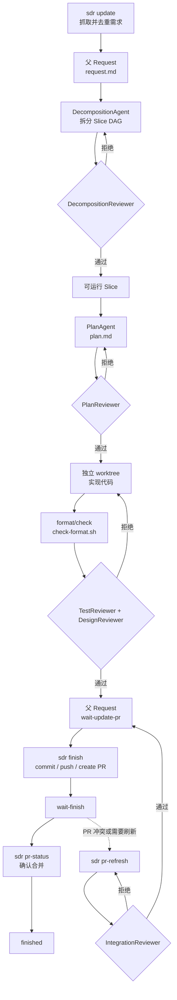

# Sandrone

`sandrone` 是一个面向 Codex 的自动开发外框架：它把一个目标 Git 仓库放进独立 workspace，自动抓取需求，拆分为可追溯的 slice，生成计划，隔离 worktree 实现，通过 reviewer gate 后再进入 PR 交付。

这个仓库本身提供两部分能力：

- Rust CLI：`sandrone`，也可以用短别名 `sdr`。
- Codex Skills：`sandrone` 和 `obsidian-change-trace`，让 Codex 知道如何使用这套流程。

适合的使用方式是：让 `tick` 自动扫描和推进需求，让 agent 写计划/代码，让 reviewer 严格拦截风险；人类只在 PR、阻塞恢复、策略调整时介入。

## 安装

### 依赖

| 工具 | 用途 |
| --- | --- |
| Git | clone、worktree、branch、push、PR 交付。 |
| Rust/Cargo | 从源码安装 CLI；Rust 目标项目默认格式检查也会使用。 |
| Codex CLI | 默认 agent/reviewer 后端。 |
| GitHub CLI `gh` | 默认 GitHub issue/PR connector 使用；内部平台可替换脚本。 |
| Node/npm + CodeGraph | 推荐安装，用于目标仓库代码索引和上下文生成。 |
| Obsidian | 可选，但推荐，用于打开 workspace 内的 `obsidian/` 变更图谱。 |

远程一键安装：

```bash
curl -fsSL https://raw.githubusercontent.com/ZhmYe/Sandrone/master/scripts/bootstrap.sh | sh
```

本地源码安装：

```bash
scripts/install.sh --force
```

安装脚本会安装 CLI、两个 Codex skill，并尽力安装/配置 CodeGraph。这里的 `--force` 用于覆盖已安装 skill；如果只想强制刷新本地二进制，可以运行 `cargo install --path . --force`。安装后建议重启 Codex App，然后验证：

```bash
sdr --help
sdr doctor
```

如果普通终端找不到 `codex`，可以设置：

```bash
export SANDRONE_CODEX_APP="/Applications/Codex.app"
export PATH="/Applications/Codex.app/Contents/Resources:$PATH"
```

更完整的安装、PATH、代理、模型 `.env`、CodeGraph 和 Obsidian 配置见 [docs/installation.md](docs/installation.md)。

## 快速开始

推荐先在 GitHub 或内部 Git 平台创建目标仓库，再由外框架 clone。即使是空项目，这样后续也能自然 push 分支和创建 PR。

```bash
mkdir -p ~/Desktop/github/MyApp-auto-dev
cd ~/Desktop/github/MyApp-auto-dev

sdr new --url https://github.com/<owner>/<repo>.git
sdr doctor
sdr update
sdr tick
sdr list
sdr dashboard
```

如果只是本地原型，也可以创建本地空仓库：

```bash
sdr new --name MyApp
```

让 Codex 介入时，可以直接说：

```text
使用 Sandrone skill，进入 /path/to/<workspace>。
先运行 sdr doctor，然后运行 sdr tick。
如果 blocked，先读 recovery.md、status.json、agent 日志和 review detail，不要绕过 reviewer gate。
```

## 流程



核心原则：

- 每个父 request 会先拆成一个或多个 slice；小需求通常只有 `S01`。
- 每个 slice 都走 `plan -> plan-review -> implementation -> code-review`。
- reviewer 有 blocking finding 时必须退回修复；gate 不可用时必须 block。
- reviewer gate 和 agent 一样异步运行：命令先派发后台 worker 并返回，worker 结束后由 hook、`sdr advance` 或下一次 `sdr tick` 收敛状态。
- 自动流程停在 `wait-update-pr` 或 `wait-finish`，不会擅自 merge。
- 所有文档、review detail、agent 日志、状态和 PR 记录都写入 workspace，便于恢复和审计。

完整状态机、slice 调度、review 轮次、PR refresh 见 [docs/workflow.md](docs/workflow.md)。

## 常用命令

| 命令 | 作用 |
| --- | --- |
| `sdr new --url <git-url>` | 初始化外框架并 clone 目标仓库到 `dev/repo`。 |
| `sdr new --name <project>` | 创建本地空目标仓库。 |
| `sdr doctor` | 检查 workspace、依赖、connector、CodeGraph 和状态目录。 |
| `sdr update` | 调用 `tools/issue-update.sh` 抓取/刷新需求，按 external ID 去重。 |
| `sdr tick` | 扫描需求、派发 agent/reviewer worker、收敛 gate、推进可继续的 request/slice。 |
| `sdr tick --request_id REQ-0001` | 只推进一个 request。 |
| `sdr list` | 在当前 workspace 列出 request。 |
| `sdr dashboard` | 打开本机所有已登记 workspace 的监控页面。 |
| `sdr status REQ-0001` | 查看单个 request 的状态、文档、分支和 worktree。 |
| `sdr doc-status --request_id REQ-0001` | 快速读取阶段文档 frontmatter 中的提交状态、format-check 摘要和 gate 状态。 |
| `sdr resume --request_id REQ-0001` | 从 blocked 恢复；gate 不可用会重跑 reviewer，代码/文档问题会回到 agent。 |
| `sdr finish --request_id REQ-0001 --message "feat: ..."` | 在 gate 通过后 commit、push 分支并创建/复用 PR。 |
| `sdr pr-refresh --request_id REQ-0001` | PR 冲突或落后 base 时执行 rebase/集成刷新。 |
| `sdr pr-status --request_id REQ-0001` | 检查 PR 是否已合并，只有确认 merged 才标记 finished。 |
| `sdr upgrade --default` | 用新版默认脚本/prompt/schema 覆盖旧 workspace。 |

完整命令参考见 [docs/commands.md](docs/commands.md)。

## Workspace 结构

```text
<workspace>/
  dev/
    repo/                 # 目标仓库主副本
    worktrees/            # 每个 request/slice 的隔离 worktree
  obsidian/
    project.md            # Obsidian 根导航
    codegraph/context.md  # CodeGraph 代码上下文
    changes/              # request/slice 文档包、review、状态、PR 记录
    derived/              # AI 友好的轻量索引
    views/                # Obsidian Bases 视图
    project.canvas        # 从 JSON 派生的人类观察图
  tools/                  # 可替换 connector 脚本
  .sandrone/        # 机器状态、事件流、锁、统一 job 日志
  .env                    # 分阶段模型和运行时配置
```

文档图谱规则很简单：`project.md -> 父 request index -> slice index -> 阶段总文档`。大段计划、实现说明和 reviewer JSON 不复制到 index，而是通过 Obsidian 链接和派生 JSON 关联。

更多目录和文档职责见 [docs/workspace-layout.md](docs/workspace-layout.md) 与 [docs/obsidian.md](docs/obsidian.md)。

## Dashboard

```bash
sdr dashboard
```

Dashboard 会读取全局 `~/.sandrone/workspaces.json`，展示本机所有已登记 workspace。左侧按项目分组，右侧显示父 request 列表；点击 request 后可以在 `需求分析 | Slice 1 | Slice 2 ... | PR` 中查看需求拆解、各 slice 的计划/实现/review detail，以及父 request 的 PR 交付、冲突刷新和合并状态。

详情见 [docs/dashboard.md](docs/dashboard.md)。

## 配置与扩展

- 模型路由在 workspace `.env` 中配置，可以按 decomposition、plan、implementation、rebase 和不同 reviewer 分别设置模型。
- 默认 GitHub issue/PR 逻辑只是 `tools/*.sh` connector，可以替换为 Jira、飞书、内部平台或其他 LLM 后端。
- `tools/check-format.sh` 是 code-review 前置检查，默认 Rust 项目会运行 `cargo fmt --check`、`cargo check` 和 `cargo clippy`。
- CodeGraph 用于目标仓库索引和 `obsidian/codegraph/context.md`，agent/reviewer 应优先读取它以减少重复扫描代码。
- Obsidian 文档和 `derived/*.json` 是恢复上下文的主要入口，适合人类和 AI 同时阅读。

扩展脚本契约见 [docs/connectors.md](docs/connectors.md)，自动化运行、finish、PR refresh 和恢复见 [docs/operations.md](docs/operations.md)。

## 详细文档

| 文档 | 内容 |
| --- | --- |
| [docs/README.md](docs/README.md) | 完整文档索引。 |
| [docs/installation.md](docs/installation.md) | 安装、依赖、环境变量、代理、模型路由。 |
| [docs/workflow.md](docs/workflow.md) | request/slice 生命周期、review gate、PR refresh。 |
| [docs/obsidian.md](docs/obsidian.md) | Obsidian vault、图谱关系、derived JSON、Canvas/Base。 |
| [docs/codegraph.md](docs/codegraph.md) | CodeGraph 安装、初始化、context 刷新和排障。 |
| [docs/dashboard.md](docs/dashboard.md) | Dashboard UI、API 和 artifact 展示规则。 |
| [docs/connectors.md](docs/connectors.md) | 可替换脚本和 reviewer JSON 契约。 |

## 开发本框架

本仓库自身的规范、proposal、变更文档和本地验证说明见：

- [docs/development.md](docs/development.md)
- [docs/constitution.md](docs/constitution.md)

常用本地验证：

```bash
cargo fmt --check
cargo check
cargo clippy --all-targets -- -D warnings
cargo test
git diff --check
```
