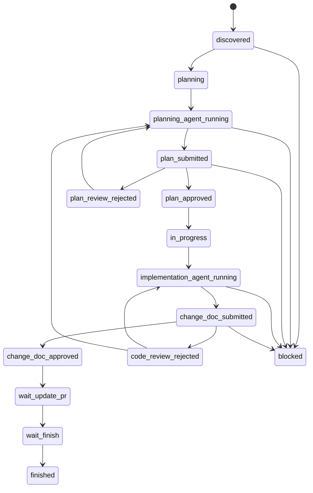

# Codex Auto Dev Workflow

`codex-auto-dev-workflow` 是一个 Rust CLI + Codex skill，用来给任意 Git 仓库套一层可审批、可追踪、可恢复、可自动推进的开发外框架。

它的目标不是替代目标项目本身，而是在目标仓库外面建立一层稳定的自动化工作流: 抓取需求、去重编号、生成计划文档包、启动 Codex 子 agent、运行严格 reviewer gate、创建独立 worktree、生成变更文档、等待最终交付、提交分支并创建或复用 PR。

## 项目作用

适合的场景:

- 从 GitHub issue、内部工作空间、工单系统或自定义脚本中持续抓取未完成需求。
- 让每个需求拥有独立 `REQ-0001` 编号、独立计划、独立 review 记录、独立 worktree 和独立交付分支。
- 用 Codex 自动写计划和代码，但把审批、review、状态和恢复都落到文件和事件流里。
- 在无人值守场景下定时 `tick`，自动推进已发现需求；最终停在 `wait-update-pr`，等待人类决定是否 commit、push 和 PR。
- 提供本地监控前端: 全局 registry 记录所有 workspace，`dashboard` 可以按项目查看需求、stage、核心文件和多轮 review detail。

不适合的场景:

- 想让 agent 绕过 review gate 直接改主分支。
- 想把多个需求混在同一个 worktree 中并一次性交付。
- 没有明确需求来源，也不愿维护 `request.md`、`plan.md`、`change-doc.md` 的项目。

## 核心原则

- 外框架与目标仓库分离: 目标仓库在 `dev/repo`，需求实现发生在 `dev/worktrees/<REQ>`，框架状态在 `.codex-auto-dev` 和 `docs/changes`。
- 文档即状态: `request.md`、`plan.md`、`change-doc.md`、`status.json`、review JSON、全局 `workspaces.json` 和 `events.ndjson` 是审计与前端展示的基础。
- reviewer gate 不可跳过: PlanReviewer、TestReviewer、DesignReviewer 必须返回结构化 JSON；任意 critical/high、非法 JSON 或 `gate_unavailable=true` 都会失败或 block。
- agent 只交付当前 phase: planning agent 只写计划；implementation agent 只在独立 worktree 中写代码和变更文档。
- connector 可替换: issue、agent、reviewer、PR 都是 `tools/*.sh`，默认走 GitHub + Codex CLI，但可以换成内部系统、Claude Code、OpenAI API 或其他后端。
- 自动化可恢复: `tick` 和 `advance` 使用状态文件和 per-request lock，避免重复派发；blocked request 可通过 `resume` 恢复。
- 最终交付显式触发: `tick` 不会运行 `finish`，也不会 merge。只有用户或操作者显式运行 `finish` 才会 commit、push、创建或复用 PR。PR 创建后如 base/master 前进或发生冲突，使用 `pr-refresh` 支线 rebase，并通过 IntegrationReviewer 后再刷新 PR。

## 架构目录

全局 registry 默认位于:

```text
~/.codex-auto-dev/
  workspaces.json
```

`CODEX_AUTO_DEV_HOME` 可以覆盖这个目录，便于测试、隔离环境或后续机器人部署。`new`、`upgrade`、`list` 和 `dashboard` 会刷新 registry；`dashboard` 依赖它找到本机所有已启用外框架的项目。

保护规则: 在 `codex-auto-dev-workflow` 源码仓库根目录运行 `codex-auto-dev new` 会被拒绝。框架源码仓库不能被初始化成自己的 managed workspace；测试真实目标项目时，应在单独的外层目录运行 `codex-auto-dev new --url ...` 或 `codex-auto-dev new --name ...`。

一个 workspace 的典型结构:

```text
<workspace>/
  .codex-auto-dev/
    config.toml
    sessions.json
    state/
      requests.tsv
      events.ndjson
      agents/
      locks/
  dev/
    repo/
    worktrees/
      REQ-0001/
  docs/
    changes/
      <YYYY-MM-DD-request-name>/
        request.md
        plan.md
        change-doc.md
        agent-journal.md
        status.json
        approvals/
        reviews/
    codegraph/
      context.md
  skills/
    codex-auto-dev-workflow/
      SKILL.md
  tools/
    issue-update.sh
    issue-update.example.sh
    issue-agent.sh
    issue-agent.example.sh
    plan-review.sh
    test-review.sh
    design-review.sh
    pr-create.sh
    prompts/
    schemas/
```

关键路径含义:

| 路径 | 作用 |
| --- | --- |
| `~/.codex-auto-dev/workspaces.json` | 全局 workspace registry，记录本机所有已登记 workspace、目标仓库、状态计数和更新时间。 |
| `.codex-auto-dev/config.toml` | workspace 基本配置，例如目标仓库名、Git URL、base branch、并发上限。 |
| `.codex-auto-dev/state/requests.tsv` | 中央 request 索引，记录 `REQ-*`、external ID、状态、分支和 worktree。 |
| `.codex-auto-dev/state/events.ndjson` | 追加式事件流，供审计、恢复和未来前端展示使用。 |
| `.codex-auto-dev/state/agents/` | agent stdout、stderr、pid、exit code 和 hook log。 |
| `dev/repo` | 目标仓库主副本，自动流程不会直接在这里实现需求。 |
| `dev/worktrees/<REQ>` | 每个需求独立实现 worktree，对应独立分支。 |
| `docs/changes/<name>` | 每个需求的计划、变更文档、approval、review 和恢复材料。 |
| `tools/*.sh` | 可替换 connector，默认实现只是参考。 |

源码维护结构:

| 路径 | 作用 |
| --- | --- |
| `src/main.rs` | CLI 命令分发、workspace 初始化、tick/agent 编排和少量流程胶水。 |
| `src/state.rs` | `requests.tsv`、`sessions.json`、`status.json`、approval 和事件流读写。 |
| `src/review_gate.rs` | PlanReviewer、TestReviewer、DesignReviewer 的门禁执行、JSON 规范化和 review 结果写入。 |
| `src/delivery.rs` | `finish` 阶段的 git commit/push、PR body 渲染和 PR connector 调用。 |
| `src/doctor.rs` | 环境诊断命令。 |
| `src/registry.rs` | 全局 `workspaces.json` 读写、刷新和当前 workspace 登记。 |
| `src/dashboard.rs` | dashboard HTTP 服务、JSON 数据模型和 stage/review artifact 映射。 |
| `src/defaults.rs` | workspace 默认目录、默认 connector、prompt、schema 和 runtime Markdown 的生成/升级。 |
| `src/utils.rs` | 时间、路径、JSON 文本解析、Markdown/TSV 转义等共享小工具。 |
| `src/assets.rs` | 编译期引用模板和静态资产，避免把长文本写在 Rust 逻辑里。 |
| `assets/dashboard/index.html` | dashboard 前端页面，属于固定静态资产，不是 workspace 模板。 |
| `templates/prompts/*.md` | 默认 agent/reviewer prompt。 |
| `templates/scripts/*.sh` | 默认 connector 脚本模板。 |
| `templates/runtime/*.md` | request、plan、change-doc、agent-journal 初始模板。 |
| `templates/schemas/*.json` | 默认结构化输出 schema。 |

## 流程可视化

```mermaid
flowchart TD
  user["用户 / heartbeat / cron"] --> tick["codex-auto-dev tick"]
  tick --> update["update: tools/issue-update.sh"]
  update --> dedup["requests.tsv 去重或刷新"]
  dedup --> eligible{"是否有 eligible request?"}
  eligible -- "否" --> idle["退出，等待下一次 tick"]
  eligible -- "是" --> packet["创建或复用 docs/changes 文档包"]
  packet --> plan_agent["planning agent: 填写 plan.md"]
  plan_agent --> hook1["agent wrapper hook"]
  hook1 --> advance_plan["advance: submit plan gate"]
  advance_plan --> plan_review["PlanReviewer"]
  plan_review --> plan_ok{"plan approved?"}
  plan_ok -- "否: planning" --> plan_agent
  plan_ok -- "否: blocked/gate unavailable" --> blocked["blocked + recovery.md"]
  plan_ok -- "是" --> start["start: git pull --ff-only + worktree"]
  start --> impl_agent["implementation agent: 写代码 + change-doc.md"]
  impl_agent --> hook2["agent wrapper hook"]
  hook2 --> advance_code["advance: submit change-doc gate"]
  advance_code --> code_review["TestReviewer + DesignReviewer"]
  code_review --> code_ok{"code-review approved?"}
  code_ok -- "否: implementation" --> impl_agent
  code_ok -- "否: planning" --> plan_agent
  code_ok -- "否: blocked/gate unavailable" --> blocked
  code_ok -- "是" --> waiting["wait-update-pr"]
  waiting --> finish["用户运行 finish"]
  finish --> pr["commit + push + tools/pr-create.sh"]
  pr --> wait_finish["wait-finish: PR 待合并"]
  wait_finish --> pr_status["pr-status / 二次 finish"]
  pr_status --> merged{"PR merged?"}
  merged -- "是" --> finished["finished"]
  merged -- "否" --> wait_finish
  wait_finish --> drift{"PR 过期或冲突?"}
  drift -- "是" --> refresh["pr-refresh: fetch + rebase"]
  refresh --> clean{"clean rebase?"}
  clean -- "是" --> integration["IntegrationReviewer"]
  clean -- "否" --> rebase_agent["RebaseAgent 解决冲突"]
  rebase_agent --> integration
  integration --> refresh_ok{"通过?"}
  refresh_ok -- "是" --> waiting
  refresh_ok -- "否" --> rebase_agent
```



状态机简图:



## 安装

从 GitHub 一键安装 CLI 和 skill:

```bash
curl -fsSL https://raw.githubusercontent.com/ZhmYe/codex-auto-dev-workflow/master/scripts/bootstrap.sh | sh
```

从本地 clone 安装 CLI 和 skill:

```bash
scripts/install.sh --force
```

只安装 skill:

```bash
scripts/install.sh --skill-only --force
```

只更新本地 CLI:

```bash
cargo install --path . --force
```

安装后建议验证:

```bash
codex-auto-dev --help
cad --help
codex-auto-dev doctor
```

`cad` 是 `codex-auto-dev` 的短命令别名。后续所有命令都可以把 `codex-auto-dev` 替换成 `cad`，例如 `cad list`、`cad tick`、`cad dashboard`。

安装或更新 skill 后，需要重启 Codex App，新的会话才会读取最新 skill。

## 环境配置

### 基础依赖

| 工具 | 是否必须 | 用途 |
| --- | --- | --- |
| Git | 必须 | clone、worktree、branch、commit、push。 |
| Rust/Cargo | 安装源码时必须 | 构建并安装 `codex-auto-dev`。 |
| Codex CLI | 默认 agent/reviewer 必须 | 默认 `issue-agent` 和 reviewer 会运行 `codex exec`。 |
| GitHub CLI `gh` | 默认 GitHub connector 需要 | 默认 issue 更新和 PR 创建脚本使用 `gh`。 |
| CodeGraph CLI | 推荐 | 初始化 `dev/repo/.codegraph`，支持架构分析和后续文档。 |

运行环境检查:

```bash
codex-auto-dev doctor
```

### Codex CLI 位置

默认 connector 解析 Codex CLI 的顺序:

1. `CODEX_AUTO_DEV_CODEX_BIN`: 直接指定 `codex` 可执行文件，或指定一个能在 PATH 中找到的命令名。
2. 当前 PATH 中的 `codex`。
3. `CODEX_AUTO_DEV_CODEX_APP`: 指向 Codex App bundle，例如 `/Applications/Codex.app`，connector 会在 app 内查找 `Contents/Resources/codex` 或 `Contents/MacOS/codex`。

推荐 zsh 配置写入 `~/.zshrc`:

```bash
# BEGIN codex-auto-dev
export CODEX_AUTO_DEV_CODEX_APP="/Applications/Codex.app"
if [ -d "/Applications/Codex.app/Contents/Resources" ]; then
  case ":$PATH:" in
    *":/Applications/Codex.app/Contents/Resources:"*) ;;
    *) export PATH="/Applications/Codex.app/Contents/Resources:$PATH" ;;
  esac
fi
# END codex-auto-dev
```

写入后重新打开终端，或执行:

```bash
source ~/.zshrc
codex --version
```

不同启动方式的配置位置:

| 启动方式 | 建议位置 |
| --- | --- |
| zsh 交互终端 | `~/.zshrc` |
| zsh 登录 shell | `~/.zprofile` |
| bash | `~/.bashrc` 或 `~/.bash_profile` |
| Codex App、LaunchAgent、GUI 调度器 | `launchctl setenv` 或用户级 LaunchAgent |

GUI 当前登录会话设置:

```bash
launchctl setenv CODEX_AUTO_DEV_CODEX_APP "/Applications/Codex.app"
```

`launchctl setenv` 对当前 macOS 登录会话有效。重启电脑后如果还需要 GUI 调度器自动继承，可以用用户级 LaunchAgent 在登录时重新设置。

### 代理

如果网络需要代理，在启动 `codex-auto-dev tick` 的同一个 shell 中设置即可。默认 agent/reviewer 脚本使用 `shell_environment_policy.inherit="all"`，子 Codex agent 会继承这些变量。

```bash
export https_proxy=http://127.0.0.1:7890
export http_proxy=http://127.0.0.1:7890
export all_proxy=socks5://127.0.0.1:7890
```

### CodeGraph

默认会在以下时机尝试初始化 `dev/repo/.codegraph`:

- `new --url` clone 非空仓库后。
- `plan` 或自动计划前 preflight。
- `start` 前需要确认目标仓库基线时。

可通过环境变量指定 CodeGraph CLI:

```bash
export CODEX_AUTO_DEV_CODEGRAPH_BIN=/path/to/codegraph
```

`dev/repo/.codegraph` 是索引目录；`docs/codegraph/context.md` 是给 agent/reviewer 读的架构文档。后者仍建议由 `codegraph-project-preview` skill 生成或刷新。

## 快速开始

### 推荐: 先创建远端仓库，再 clone 到外框架

即使目标项目是从零开始，也推荐先在 GitHub 或内部 Git 平台创建空仓库，然后让外框架 clone 它。这样后续 `finish` 可以自然 push 分支并创建 PR。

```bash
mkdir -p ~/Desktop/github/PoorGuy-auto-dev
cd ~/Desktop/github/PoorGuy-auto-dev
codex-auto-dev new --url https://github.com/ZhmYe/PoorGuy.git
codex-auto-dev doctor
```

如果仓库有内容，先生成或刷新 CodeGraph 项目文档:

```text
让 Codex 使用 codegraph-project-preview skill，为 dev/repo 生成 docs/codegraph/context.md
```

然后可以抓取 issue:

```bash
codex-auto-dev update
codex-auto-dev list
```

打开本地监控面板:

```bash
codex-auto-dev dashboard
```

也可以用短命令:

```bash
cad dashboard
```

如果页面为空，通常表示全局 registry 还没有登记 workspace。进入某个外框架目录运行以下任一命令即可刷新登记:

```bash
cad list
cad upgrade
cad dashboard --json
```

启动自动流程:

```bash
codex-auto-dev tick
```

只推进某个 request:

```bash
codex-auto-dev tick --request_id REQ-0003
```

### 本地空项目原型

CLI 也支持本地空项目:

```bash
mkdir -p ~/Desktop/github/MyApp-auto-dev
cd ~/Desktop/github/MyApp-auto-dev
codex-auto-dev new --name MyApp
```

这种方式会在 `dev/repo` 创建本地 Git 仓库，`git_url` 记录为 `local:MyApp`。如果后续需要自动 push/PR，仍应补远端并配置 `origin`。

### 让 Codex 介入

安装 skill 后，可以对 Codex 说:

```text
使用 codex-auto-dev-workflow skill，进入 /path/to/<workspace>。
先运行 codex-auto-dev doctor。
然后运行 codex-auto-dev tick。
如果发现 blocked，先读 recovery.md、status.json、agent 日志和 review summary，不要绕过 reviewer gate。
```

如果要定时扫描:

```text
每 15 分钟进入 /path/to/<workspace> 运行 codex-auto-dev tick。
tick 只负责扫描、派发和兜底推进，不运行 finish。
```

## 命令参考

### Workspace

| 命令 | 作用 |
| --- | --- |
| `codex-auto-dev new --url <git-url>` | 初始化外框架并 clone 目标仓库到 `dev/repo`。 |
| `codex-auto-dev new --name <project-name>` | 初始化本地空目标仓库，适合原型。 |
| `codex-auto-dev doctor` | 检查 workspace、Git、Codex CLI、GitHub CLI、CodeGraph、connector、schema 和事件目录。 |
| `codex-auto-dev validate` | 检查已有 request 是否具备必要 runtime 文档。 |
| `codex-auto-dev upgrade --dry-run` | 查看旧 workspace 会被升级哪些内容。 |
| `codex-auto-dev upgrade` | 升级旧 workspace 的 schema、session registry、reference example 和 runtime 文档。 |
| `codex-auto-dev upgrade --default` | 在刷新 `.example.*` 后，用默认实现覆盖正式 connector、prompt 和 schema。 |

### Dashboard

| 命令 | 作用 |
| --- | --- |
| `codex-auto-dev dashboard` | 启动本地监控页面 HTTP 服务，默认监听 `127.0.0.1:47217`，终端会打印访问 URL。 |
| `codex-auto-dev dashboard --host 127.0.0.1 --port 47220` | 指定监听地址和端口，便于同时开多个临时面板。 |
| `codex-auto-dev dashboard --port 0` | 使用系统分配的空闲端口，启动后以终端打印的 URL 为准。 |
| `codex-auto-dev dashboard --json` | 输出 dashboard 数据模型，便于测试、机器人或未来前端复用。 |
| `cad dashboard` | `codex-auto-dev dashboard` 的短命令别名。 |

Dashboard 依赖全局 `~/.codex-auto-dev/workspaces.json` 查找所有项目。`new`、`upgrade`、`list`、`dashboard` 会刷新 registry；旧 workspace 如果没有出现在页面里，先进入该 workspace 运行 `cad list` 或 `cad upgrade`。

服务端点:

- `/`: dashboard 页面。
- `/api/dashboard`: 与 `dashboard --json` 等价的数据模型。
- `/api/health`: 简单健康检查。

页面当前支持:

- 左侧项目侧边栏，按项目分组展示本机所有已登记 workspace。
- 项目标签只显示三类: `blocked`、`pending`、`finish`。`finish` 只统计真正 `finished` 的 request；`pending` 包含 `wait-update-pr`、`wait-finish` 以及所有非 blocked、非 finished 的状态。
- 右侧 request 纵向列表，可点击切换需求；列表有最大高度，超出后内部滚动。
- Request 列表会优先展示未完成项；`finished` 会稳定排在后面，避免新发现或待处理需求被已完成需求压住。
- 默认主线 6 段 timeline: `Request -> Plan -> Plan Review -> Implementation -> Code Review -> Finish / PR`；只有存在 `integration-review` 记录时，才切换为双层 timeline: 上层到 `Code Review` 为止，下层居中展示 `PR Refresh -> Integration Review -> Finish / PR`。Integration Review 通过后状态回到 `wait-update-pr`，下层 `Finish / PR` 作为当前待操作节点显示，直到再次运行 `finish` 推送并刷新 PR。
- 点击 stage 后，下方只展示当前 stage 的核心文件或 review detail。
- Markdown 使用 `marked` + `DOMPurify` + `highlight.js` 渲染；JSON/reviewer detail 使用 `jsoneditor` 只读展示。
- 页面整体可以自然超过一屏并由浏览器滚动；项目列表、request 列表和下方 Markdown/JSON 阅读区各自有最大高度和内部滚动。

### Request 与状态

| 命令 | 作用 |
| --- | --- |
| `codex-auto-dev update` | 调用 `tools/issue-update.sh`，新增或刷新 request；按 external ID 去重。 |
| `codex-auto-dev list` | 列出 request ID、状态和标题。 |
| `codex-auto-dev status` | 输出 workspace 基本信息和各状态计数。 |
| `codex-auto-dev status REQ-0001` | 输出单个 request 的来源、状态、文档路径、分支和 worktree。 |
| `codex-auto-dev sessions` | 列出 session registry。 |
| `codex-auto-dev sessions --json` | 以 JSON 输出 session registry。 |
| `codex-auto-dev session --request_id REQ-0001 --phase planning --thread_id <id>` | 手动登记某个 request 的可见会话信息。 |

### 自动推进

| 命令 | 作用 |
| --- | --- |
| `codex-auto-dev tick` | 扫描全部 request，刷新已结束 agent 状态，并在并发上限内派发 planning 或 implementation agent。 |
| `codex-auto-dev tick --request_id REQ-0001` | 只处理一个 request。 |
| `codex-auto-dev tick --parallel-limit 2` | 单次覆盖并发上限。 |
| `codex-auto-dev tick --max-attempts 20` | 设置本次自动 review 修复最大轮数。 |
| `codex-auto-dev advance --request_id REQ-0001` | 推进单个 request；通常由 agent wrapper hook 自动调用。 |

### 手动门禁

自动流程通常不需要手动跑这些命令，但它们便于调试、替代 connector 或人工恢复。

| 命令 | 作用 |
| --- | --- |
| `codex-auto-dev plan --name <YYYY-MM-DD-short-name> --request_id REQ-0001` | 创建 change 文档包和计划模板。 |
| `codex-auto-dev submit --request_id REQ-0001 --gate plan` | 提交 plan gate。 |
| `codex-auto-dev plan-review --request_id REQ-0001` | 运行 PlanReviewer。 |
| `codex-auto-dev start --request_id REQ-0001` | 在 plan approval 有效后创建 worktree 和 request 分支。 |
| `codex-auto-dev submit --request_id REQ-0001 --gate change-doc` | 提交 change-doc gate。 |
| `codex-auto-dev code-review --request_id REQ-0001` | 运行 TestReviewer 和 DesignReviewer。 |
| `codex-auto-dev integration-review --request_id REQ-0001` | 运行 PR rebase/冲突解决后的轻量集成门禁。 |
| `codex-auto-dev approvals --request_id REQ-0001` | 查看 approval 状态。 |
| `codex-auto-dev approvals --request_id REQ-0001 --json` | 以 JSON 查看 approval 状态。 |
| `codex-auto-dev approve --request_id REQ-0001 --gate plan --by <actor>` | 人工批准 gate。 |
| `codex-auto-dev reject --request_id REQ-0001 --gate plan --by <actor>` | 人工拒绝 gate。 |

### 阻塞、恢复和交付

| 命令 | 作用 |
| --- | --- |
| `codex-auto-dev block --request_id REQ-0001 --stage implementation --reason "<reason>"` | 显式标记 blocked 并写入 `recovery.md`。 |
| `codex-auto-dev resume --request_id REQ-0001` | 从 blocked 恢复到 `planning` 或 `in-progress`，同步 `requests.tsv` 和 `status.json`。 |
| `codex-auto-dev finish --request_id REQ-0001 --message "feat: add feature"` | 在 change-doc approval 有效后 commit、push 分支并调用 PR connector；成功后进入 `wait-finish`。 |
| `codex-auto-dev pr-status --request_id REQ-0001` | 调用 PR 状态脚本；`merged` 标记 `finished`，`open` 保持/修正为 `wait-finish`，`missing` 或 `closed` 回到 `wait-update-pr`。 |
| `codex-auto-dev pr-refresh --request_id REQ-0001` | PR 已创建后同步 base/master，尝试 rebase；冲突时派发 RebaseAgent，完成后必须过 IntegrationReviewer。 |

## Runtime 文档包

每个 request 位于:

```text
docs/changes/<YYYY-MM-DD-request-name>/
  request.md
  plan.md
  change-doc.md
  agent-journal.md
  status.json
  approvals/
    plan.approval.json
    change-doc.approval.json
  reviews/
    plan-review/
      summary.json
      details/
    code-review/
      summary.json
      details/
    integration-review/
      summary.json
      details/
  pr-conflicts/
    attempts/
```

文档职责:

| 文件 | 说明 |
| --- | --- |
| `request.md` | 固化需求来源、标题、描述和 URL。 |
| `plan.md` | 计划文档，顶部必须保留 `## 规范化需求记录`。 |
| `change-doc.md` | 实现说明，重点写实现前后对比、关键设计、验证证据和 review 处理，不需要完整文件清单。 |
| `agent-journal.md` | agent 每轮读取内容、修改内容、review finding 处理、验证结果和下一步。 |
| `status.json` | request 当前阶段、状态、worktree、branch 和关键文档路径。 |
| `approvals/*.json` | 文件化审批，包含 artifact hash；文档修改后 approval 会过期。 |
| `reviews/*/summary.json` | 当前 review stage 汇总。 |
| `reviews/*/details/*.json` | 每个 reviewer、每一轮 attempt 的原始结构化结果。 |
| `pr-conflicts/attempts/*.md` | PR rebase 冲突记录；每次真正发生冲突时递增编号，clean rebase 不写入这里。 |

`plan.html`、runtime `spec.md` 和 runtime `tasks.md` 已不再生成。`plan.md` 合并规格、计划和任务清单，`change-doc.md` 汇总最终实现与 review。

## Dashboard 展示规则

`codex-auto-dev dashboard` 会读取全局 `workspaces.json`，刷新每个仍存在的 workspace，然后在浏览器里按项目展示需求进度。

Request 列表只做展示层排序，不改变 API、`requests.tsv` 或状态机数据:

1. 未完成 request 排在前面，包括 `discovered`、agent running、review rejected、`wait-update-pr`、`wait-finish` 和 `blocked`。
2. `finished` request 排在后面。
3. 同一组内保留原始 request 顺序，刷新页面时不会因为排序规则产生无意义跳动。

主 timeline 固定为 6 个阶段:

```text
Request -> Plan -> Plan Review -> Implementation -> Code Review -> Finish / PR
```

PR 已创建后，如果运行 `codex-auto-dev pr-refresh` 并产生 Integration Review 记录，dashboard 会切换为双层 timeline；Integration Review 通过后，request 回到 `wait-update-pr`，表示还需要再次运行 `finish` 把 rebase 后的分支推到远端:

```text
Request -> Plan -> Plan Review -> Implementation -> Code Review
                                      ...
                          PR Refresh -> Integration Review -> Finish / PR (active)
```

普通阶段只展示一个核心文件:

| Stage | 核心文件 |
| --- | --- |
| Request | `request.md`，尚未创建 change 包时显示 request 索引中的需求记录。 |
| Plan | `plan.md`。 |
| Implementation | `change-doc.md`。 |
| Finish / PR | 优先显示 `.codex-auto-dev/state/<REQ>-pr-body.md`，否则显示 `status.json`。 |
| PR Refresh | 优先展示 `pr-conflicts/attempts/*.md` 中的真实 rebase 冲突 attempt；如果没有冲突 attempt，才回退展示 `change-doc.md` 中抽取出的 `PR 集成刷新记录` / `PR 冲突记录` 章节。 |

review 阶段是例外:

- Plan Review 读取 `reviews/plan-review/details/*.json`。
- Code Review 读取 `reviews/code-review/details/*.json`。
- Integration Review 读取 `reviews/integration-review/details/*.json`。
- 多轮 review 会按文件名前缀 `001-*`、`002-*` 分组展示。
- 页面不依赖 `summary.json` 呈现 review 详情，因为 summary 只代表最新汇总且可能被覆盖。
- `recovery.md` 不进入主 stage 区域；阻塞时可以从 `status.json`、事件流或命令行恢复流程继续查看。

页面呈现规则:

- 左侧项目卡片只显示 `blocked`、`pending`、`finish` 三个状态标签；不再单独显示 `waiting`、`running` 或 request 总数。`pending` 包含 `wait-update-pr` 和 `wait-finish`；顶部统计会单独显示 `PR 待合并`。
- request 区域是纵向列表，不是卡片瀑布流，便于扫描较多需求；未完成 request 永远优先显示，已完成 request 收在后面。
- request 列表、项目列表和下方 artifact 阅读区都有最大高度；超过上限后在局部区域内部滚动，整个 dashboard 页面本身也允许自然超过一屏。
- Markdown 文件通过 `marked` 渲染，使用 `DOMPurify` 清洗 HTML，并用 `highlight.js` 高亮代码块。
- JSON 文件和 reviewer detail 通过 `jsoneditor` 的只读 view 模式展示，支持折叠查看。
- 如果 CDN 不可用，页面会回退到纯文本展示，不影响核心监控能力。

常见交付状态:

| 状态 | 含义 | 下一步 |
| --- | --- | --- |
| `wait-update-pr` | review 已通过，但 PR 尚未创建、创建失败，或 rebase/IntegrationReviewer 通过后需要重新更新 PR 分支。 | 运行 `finish --request_id <REQ>`。 |
| `wait-finish` | PR 已创建或已更新，正在等待平台合并。 | 合并后运行 `pr-status --request_id <REQ>`。 |
| `finished` | PR 已由 `tools/pr-status.sh` 确认合并。 | 无需继续自动推进。 |

## Connector Contract

所有 connector 都是可替换脚本。替换时只需要遵守输入输出契约。

### `tools/issue-update.sh`

stdout 输出零行或多行 TSV，无 header:

```text
external_id<TAB>source<TAB>title<TAB>body<TAB>url
```

字段要求:

- `external_id`: 稳定且全局可去重，例如 `github:owner/repo#123`。
- `source`: 短平台名，例如 `github`、`jira`、`internal`。
- `title`: 规范化需求名称。
- `body`: 完整需求描述，不能只给标题。
- `url`: 原始需求链接，可为空。

`update` 会按 `external_id` 去重。已存在 request 会刷新标题、描述、URL 和更新时间，不会重复创建新 request。

### `tools/issue-agent.sh`

`issue-agent` 不是一个过时的单体 agent，而是默认 agent connector 的名字:

- `tools/issue-agent.sh`: 负责启动 Codex CLI 或你替换的其他 agent 后端。
- `tools/prompts/issue-agent.md`: planning/implementation 共用的共享 agent 契约。
- `tools/prompts/plan-agent.md`: planning phase 的具体提示词。
- `tools/prompts/implementation-agent.md`: implementation phase 的具体提示词。

每次只处理一个 phase:

- `CODEX_AUTO_DEV_AGENT_PHASE=planning`: 只写 `plan.md` 和 `agent-journal.md`，不改目标代码。
- `CODEX_AUTO_DEV_AGENT_PHASE=implementation`: 只在 `CODEX_AUTO_DEV_WORKTREE` 中写代码，更新 `change-doc.md` 和 `agent-journal.md`。

agent 在退出前必须先自检，不要把明显会失败的产物交给 reviewer:

- planning 必须做 `PlanReviewer 提交前自检`，逐项核对需求完整性、目标顺序、代码位置、测试策略、兼容/迁移/回滚、目标项目要求、硬编码/敏感信息和审批门禁。发现会产生 critical/high 的缺口时，先修 `plan.md` 或 block。
- implementation 必须做 `Code Review 提交前自检`，逐项核对 TestReviewer 的测试覆盖、失败路径、回归、baseline failure、验证证据，以及 DesignReviewer 的需求完成度、approved plan 符合度、可扩展性、硬编码、敏感信息、破坏性风险、错误处理、文档和 checklist。发现会产生 critical/high 的缺口时，先修代码、测试、文档或 block。
- 自检结果必须写入 `agent-journal.md`；implementation 还必须在 `change-doc.md` 中记录自检摘要。

agent 不得:

- 调用 `submit`、`plan-review`、`code-review`、`start`、`finish`。
- 调用 `approve`、`reject` 或手写 approval JSON。
- commit、push、创建 PR 或 merge。
- 修改 reviewer 脚本、review schema 或本地构造假 reviewer 来绕过门禁。

### `tools/plan-review.sh`

必须输出一个符合 `tools/schemas/review-result.schema.json` 的 JSON 对象。PlanReviewer 基于需求、目标仓库、CodeGraph、`request.md` 和 `plan.md` 评审计划。

### `tools/test-review.sh` 与 `tools/design-review.sh`

code-review 会分别调用:

- TestReviewer: 审查新增测试、回归测试、失败路径、目标项目检查和 baseline failure 处理。
- DesignReviewer: 审查实现是否满足需求和 approved plan，是否无硬编码、无隐私数据、无未授权破坏性变更、无明显 bug，并满足目标项目内部要求。

两个 reviewer 输入隔离。它们只能读取各自的 `$CODEX_AUTO_DEV_REVIEW_CONTEXT` 和目标 worktree/仓库中的必要文件，不能读取其他 reviewer 输出、历史 review summary/detail 或 agent journal。

### Review JSON

reviewer 只能输出 JSON，不得输出 Markdown、代码块或前后缀。必须包含:

```json
{
  "reviewer": "PlanReviewer",
  "approved": false,
  "gate_unavailable": false,
  "decision": "rejected",
  "recommended_next_phase": "planning",
  "summary": "summary",
  "process": ["read request", "read plan"],
  "critical": [],
  "high": [],
  "warning": [],
  "info": []
}
```

每个 finding 必须包含:

```json
{
  "title": "问题标题",
  "evidence": "具体证据",
  "impact": "不修复的影响",
  "required_fix": "必须修复什么",
  "suggested_change": "建议怎么改",
  "verification": "修复后如何验证"
}
```

判断规则:

- 任意 `critical` 或 `high` 非空，review 必须不通过。
- `gate_unavailable=true` 必须 block，不能自动绕过。
- `recommended_next_phase=planning` 表示回到计划。
- `recommended_next_phase=implementation` 表示继续修实现。
- `recommended_next_phase=blocked` 表示需要人工恢复。

### `tools/pr-create.sh`

finish 时调用。脚本必须先判断当前平台/仓库是否支持创建 PR，再检查 base/head 是否已有 PR。

成功时 stdout 输出:

```text
created<TAB>url
```

或:

```text
existing<TAB>url
```

旧脚本只输出 URL 仍按 `created` 兼容。失败时 stderr 输出原因，不得 merge。

### `tools/pr-status.sh`

`pr-status` 和 `pr-refresh` 调用。脚本只观察 PR 状态，不修改代码、分支或 PR。

成功时 stdout 输出:

```text
status<TAB>url<TAB>detail
```

推荐 status: `open`、`missing`、`merged`、`closed`、`unknown`。GitHub 默认实现使用 `gh pr list` 按 base/head 查找已有 PR；内部平台可以替换该脚本。

## 自动化运行

`tick` 是短主控:

1. 调用 `update`。
2. 刷新已结束 agent 状态。
3. 选择 eligible request。
4. 在并发上限内派发 planning 或 implementation agent。
5. 对漏掉 hook 的 request 执行 `advance` 兜底推进。
6. code-review 通过后停在 `wait-update-pr`。

新 workspace 默认:

```toml
parallel_limit = 1
```

可以修改 `.codex-auto-dev/config.toml`，或单次运行:

```bash
codex-auto-dev tick --parallel-limit 2
```

定时方式可以使用 Codex heartbeat、cron、LaunchAgent 或其他调度器。无论哪种方式，建议先确保:

```bash
cd /path/to/workspace
codex-auto-dev doctor
codex-auto-dev tick
```

如果定时任务从 GUI 或后台启动，务必确认 `CODEX_AUTO_DEV_CODEX_APP`、代理和 PATH 已经在该启动环境生效。

## Finish 与 PR

自动流程结束在 `wait-update-pr`:

```bash
codex-auto-dev list
codex-auto-dev status REQ-0001
```

人类确认 `change-doc.md`、review summary 和目标项目验证后，再运行:

```bash
codex-auto-dev finish --request_id REQ-0001 --message "feat: add movement hero support"
```

`finish` 会:

1. 校验 change-doc approval 有效。
2. 在 request worktree 中 commit。
3. push request 分支。
4. 调用 `tools/pr-create.sh` 创建或复用 PR。
5. PR 创建或复用成功后标记 request 为 `wait-finish`；如果 PR connector 失败，则保持 `wait-update-pr`，允许修复 connector 后重试。

`wait-finish` 表示 PR 已提交但尚未合并。PR 合入后运行:

```bash
codex-auto-dev pr-status --request_id REQ-0001
```

或者再次运行 `finish --request_id REQ-0001`。这两个入口都会调用 `tools/pr-status.sh`，只有脚本返回 `merged` 时才把 request 标记为 `finished`。如果旧版本把 open PR 误标为 `finished`，运行 `pr-status` 会根据脚本结果修正为 `wait-finish`；如果脚本返回 `missing` 或 `closed`，则回到 `wait-update-pr`，等待重新创建或更新 PR。

PR body 会包含:

- request 来源和链接。
- `task.md`/计划与 change-doc 路径引用。
- `change-doc.md` 摘要。
- 自动评审意见，包括 warning/info finding 的证据、影响、必要修复、建议修改和验证方式。

`finish` 不会 merge。

### PR Refresh / Rebase 支线

PR 已创建后，如果 GitHub 或内部平台提示和 base/master 冲突，或者过一段时间后希望刷新到最新 base，运行:

```bash
codex-auto-dev pr-refresh --request_id REQ-0001
```

`pr-refresh` 会:

1. 调用 `tools/pr-status.sh` 记录当前 PR 状态。
2. 在 request worktree 中 fetch base 分支。
3. 尝试 `git rebase origin/<base>`。
4. clean rebase 时更新 `change-doc.md` 的 `PR 集成刷新记录`，然后运行 IntegrationReviewer。
5. rebase 冲突时写入 `pr-conflicts/attempts/NNN-rebase-conflict.md` 和 `change-doc.md` 的 `PR 冲突记录`，然后进入 `rebase-agent-running`，派发 RebaseAgent 解决冲突；agent 退出后 hook 会调用 `advance`，继续运行 IntegrationReviewer。
6. IntegrationReviewer 通过后重新批准 `change-doc`，request 回到 `wait-update-pr`。

IntegrationReviewer 是轻量集成门禁，不替代首次实现后的 TestReviewer + DesignReviewer。它重点审:

- 冲突文件是否解决干净，没有 `<<<<<<<`、`=======`、`>>>>>>>` 残留。
- 是否保留 approved plan 和已通过 code-review 的实现语义。
- 是否只做集成适配，没有扩大需求范围。
- 是否处理了 base/master 新代码带来的接口、测试、配置或行为变化。
- 是否保留 base/master 新修改，不能为了自己分支的修改删除 base/master 新代码。
- 是否运行目标项目测试或合理替代验证。
- `change-doc.md` 是否记录冲突原因、解决方式、实现前后对比和验证结果。

如果 IntegrationReviewer 发现语义变化、大范围非冲突改动、公共 API/安全/迁移风险或测试缺口，会拒绝并回到 RebaseAgent；必要时要求升级回完整 code-review 或 block。

RebaseAgent 只能解决 rebase/集成冲突，不得 commit、push、finish、创建 PR、merge、approve/reject 或修改 reviewer。它必须同时保留 base/master 新代码和 request 分支实现，不能用粗暴 `ours/theirs` 覆盖来绕过冲突。

同一个 PR 可能多次遇到冲突。框架只在真实冲突发生时追加 `pr-conflicts/attempts/NNN-rebase-conflict.md`，不会为 clean rebase、merged skip 或普通 continue 生成 attempt 文件。这样可以保留冲突历史，又不会让 dashboard 被非冲突刷新记录淹没。

IntegrationReviewer 通过后，再运行:

```bash
codex-auto-dev finish --request_id REQ-0001 --message "feat: add movement hero support"
```

这是 PR refresh 后的提交/推送脚本入口。`finish` 会跳过空提交、重新生成 PR body，并 push request 分支；遇到 rebase 后的非快进推送会自动使用 `git push --force-with-lease -u origin <branch>`。`tools/pr-create.sh` 仍负责创建或复用 PR。

如果不是由 RebaseAgent 自动解决，而是人工或外部工具完成了 rebase 冲突处理，可以运行 `codex-auto-dev pr-refresh --request_id REQ-0001 --mode continue`，它会校验 rebase 已完成、没有 unmerged 文件，然后运行 IntegrationReviewer。

## 升级旧 Workspace

先更新本机 CLI 和 skill:

```bash
cd /path/to/codex-auto-dev-workflow
scripts/install.sh --force
```

或只更新 CLI:

```bash
cargo install --path . --force
```

再进入旧 workspace:

```bash
cd /path/to/old-workspace
codex-auto-dev upgrade --dry-run
codex-auto-dev upgrade
```

普通 `upgrade` 会刷新 `.example.*` 参考文件，但不会覆盖正式 `tools/*.sh`、`tools/prompts/*.md`、review schema 或已经存在的 `agent-journal.md` 历史记录。
它也会把当前 workspace 写入全局 `workspaces.json`，这样旧项目升级后会出现在 dashboard 中。

如果确认没有自定义 connector、prompt 或 schema，可以运行:

```bash
codex-auto-dev upgrade --default
```

`--default` 会先刷新 `.example.*`，再把默认实现覆盖到正式文件。它适合恢复默认脚本，或把旧 workspace 的 connector 升级到新版默认逻辑。

## 排障与恢复

### agent 找不到 Codex CLI

症状:

```text
codex CLI is unavailable
codex CLI is not installed
```

处理:

```bash
export CODEX_AUTO_DEV_CODEX_APP="/Applications/Codex.app"
codex-auto-dev doctor
codex-auto-dev resume --request_id REQ-0003
codex-auto-dev tick --request_id REQ-0003
```

如果旧 workspace 的 `tools/issue-agent.sh` 还是旧版，先更新 CLI，再运行:

```bash
codex-auto-dev upgrade --default
```

### request blocked

先读:

```text
docs/changes/<name>/recovery.md
docs/changes/<name>/status.json
docs/changes/<name>/agent-journal.md
docs/changes/<name>/reviews/*/summary.json
.codex-auto-dev/state/agents/<REQ>.stderr.log
```

确认阻塞原因修复后:

```bash
codex-auto-dev resume --request_id REQ-0001
codex-auto-dev tick --request_id REQ-0001
```

不要手写 approval JSON，不要修改 reviewer 输出绕过门禁。

### worktree 前 git pull 失败

`start` 或自动 implementation 派发前会在非空、有 remote 的 `dev/repo` 执行:

```bash
git pull --ff-only
```

如果 pull 分叉、冲突或失败，request 会 block。需要先在 `dev/repo` 处理远端同步问题，然后:

```bash
codex-auto-dev resume --request_id REQ-0001
codex-auto-dev tick --request_id REQ-0001
```

### reviewer gate unavailable

如果 reviewer backend、网络、schema、关键上下文不可用，reviewer 应返回 `gate_unavailable=true` 或非 0，框架会 block。修复 backend 或环境后用 `resume` 恢复，不要重试绕过。

### CodeGraph 未初始化

检查:

```bash
codex-auto-dev doctor
```

手动初始化:

```bash
codegraph init -i dev/repo
```

如果 CLI 名称不是 `codegraph`:

```bash
export CODEX_AUTO_DEV_CODEGRAPH_BIN=/path/to/codegraph
```

## 安全与质量要求

agent 和 reviewer prompt 会要求目标项目满足自己的规则，包括但不限于:

- 阅读目标项目文档和贡献指南。
- 更新目标项目要求的 change doc、文档、测试或 pre-commit 结果。
- 运行 format、lint、test、文档检查、AI review 等项目要求。
- 不写硬编码 API key、token、隐私数据。
- 不用特殊项目名硬编码业务逻辑；需要通用抽象。
- Rust 项目中生产代码不得随意 `panic`、`unwrap`、`expect`；测试代码除外。确有必要时必须说明原因并用项目接受的方式标注。
- implementation agent 运行测试时，如果发现不是当前分支引入的已有失败，也应在当前 worktree 中修复并复验；除非修复会破坏 approved plan、缺少外部权限/数据或无法安全判断。
- 所有交付文档中的 checklist 必须全部打勾；无法由当前流程完成的事项要移到 `后续流程`、`人工事项` 或 `阻塞项`，并写清 owner、触发条件、原因和风险。

## 框架仓库治理

本源码仓库使用:

```text
proposal.json
docs/proposals/YYYY-MM-DD/<proposal-id>/
  spec.md
  plan.md
  tasks.md
  plan.html
  change-doc.md
```

生成给用户的 runtime workspace 不需要本仓库的 `proposal.json`。

本地验证:

```bash
cargo fmt --check
cargo check
cargo clippy --all-targets -- -D warnings
cargo test
python3 scripts/validate_proposals.py
git diff --check
```

文档或 proposal-only 变更至少运行:

```bash
python3 scripts/validate_proposals.py
git diff --check
```
