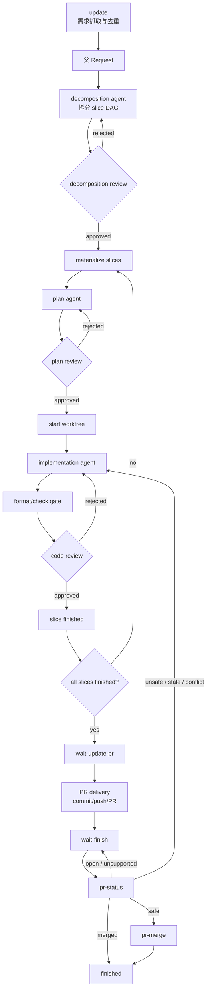

# 工作流

`sandrone` 的核心目标是把自动开发变成可追溯、可恢复、可审核的状态机。CLI 负责机械动作和门禁，Codex agent 负责分析、计划、实现和修复。

## 概念

| 概念 | 说明 |
| --- | --- |
| Workspace | 外框架目录，包含 `dev/repo`、`obsidian/`、`tools/` 和 `.sandrone/`。 |
| Target repo | 被开发的真实仓库，位于 `dev/repo`。 |
| Request | 从 issue、用户输入或内部系统提取的父需求，ID 形如 `REQ-0001`。 |
| Slice | request 拆分后的可执行小需求，ID 形如 `REQ-0001-S01`。小需求可以只有一个 slice。 |
| Gate | reviewer 或人工审批门禁，状态记录在对应阶段 Markdown 文档 frontmatter 的 `gate_*` 字段。 |
| Agent | 默认由 `tools/issue-agent.sh` 启动的 Codex 子运行，按 phase 执行 decomposition、planning 或 implementation。 |
| Reviewer | 独立结构化评审器，输出 JSON。任意 critical/high finding 都会拒绝 gate。 |

## 总流程



## Loop 主控

`sandrone loop` 是推荐的外层自动化入口:

```bash
sandrone loop start --interval-seconds 900
sandrone loop restart --request_id REQ-0001
sandrone loop stop --request_id REQ-0001 --reason "manual pause"
sandrone dashboard
```

每个 loop pass 会执行一次内部 tick；`loop stop` 是软停止信号，只阻止下一轮开始，不强杀正在写代码或评审的 agent。`loop stop --request_id` 会主动把单个 request 标记为 blocked；`loop restart` 只负责 resume blocked request，继续自动化仍由 `loop start` 负责。

Sandrone 使用 cohort 批次语义：当没有 active cohort 时，RequestScheduleAgent 才会选择最多 `parallel_limit` 个父 request，写入 `.sandrone/state/scheduler/cohort.json`。active cohort 存在期间，loop 只推进 cohort 内父 request 及其 slice，并且 PR delivery / merge 也只处理 cohort 内 request。只有 cohort 内每个父 request 都 `finished`，或因为自身/任一 slice `blocked` 而需要人工处理后，cohort 才会完成并归档到 `last-cohort.json`，下一轮才会重新调度新 request。

active cohort 的实时进度会写入 `.sandrone/state/scheduler/cohort-progress.json`。任一 request/slice 状态保存都会刷新进度文件并写入 `.sandrone/state/loop/wake`；loop worker 监听该目录的文件事件，收到 wake 后立即进入下一轮。如果文件事件漏掉，才按 `--interval-seconds` 做兜底巡检。

内部 tick 的顺序是：

1. 运行 `update`。
2. 刷新已结束 agent 和 review worker 状态。
3. 如果已有 active cohort，找出 cohort 内 eligible request/slice；否则找出可进入新 cohort 的父 request。
4. 统计并发槽位；只有没有 active cohort 时，才把候选写入 request schedule queue。
5. 调用 RequestScheduleAgent 选择本批最多 `parallel_limit` 个父 request，再由 RequestScheduleReviewer 审核调度计划并固化 cohort。
6. 在 active cohort 集合内派发 agent。
7. 对漏掉 hook 的 request 执行兜底推进；如果 review worker 已结束，会收敛 summary、gate 和下一步状态。
8. code-review 通过后停在 `wait-update-pr`。

Request schedule 只决定“下一批 cohort 先做哪些父 request”，不审代码、不改状态、不绕过任何 gate。它的运行产物位于 `agents/request-schedule-agent/runs/**/artifacts/`、`agents/request-schedule-reviewer/runs/**/artifacts/`，兼容副本位于 `.sandrone/state/scheduler/`，人类可读摘要位于 `obsidian/schedule/request-schedule.md`。

PR 交付和合并默认自动串行执行。code-review 通过后进入 `wait-update-pr`；loop 会提交分支、创建或复用 PR，并进入 `wait-finish`。随后每轮最多处理一个 cohort 内 `wait-finish` request：先调用 `tools/pr-status.sh`，只有返回 `safe` 才调用 `tools/pr-merge.sh`；返回 `merged` 会标记 finished，返回 `unsafe` 会把对应父 request 或最后一个可修复 slice 退回 implementation。ImplementationAgent 处理 PR 过期、base/master drift、冲突或平台检查失败后，仍必须重新通过 format/check 与 code-review，再回到 `wait-update-pr` 更新 PR。

内部 `advance --request_id <REQ>` 是单 request 推进器，通常由 agent wrapper hook 或 review worker hook 自动调用。它不抓 issue，也不扫描全部 request，只在 per-request lock 下完成当前 request 的 gate、worktree、review worker 收敛、下一 phase 派发或状态落盘。

agent wrapper 会记录 stdout、stderr、pid、exit code 和 hook log。Codex CLI 可能因为早期工具命令失败而最终返回非零；只有当 agent 最后把当前阶段文档的 Sandrone frontmatter 标记为 `agent_status: submitted`、`agent_ready_for_review: true` 时，外层才会把这次非零退出视为“产物已准备好，继续进入 review gate”。没有有效文档提交状态的非零退出仍然会 block。

## Review Worker

review gate 和 implementation agent 使用同一种异步推进模型:

1. loop 内部推进器看到 `*-submitted` 状态后，派发对应 reviewer worker，并把状态写成 `*-review-running`。
2. 每个 reviewer worker 独立运行脚本，把 detail JSON 写入 `reviews/<stage>/details/`，同时在 `agents/<reviewer>/runs/<timestamp-REQ-stage-attempt>/` 记录 pid、exit、stdout、stderr、hook、events、runtime 元数据和 review context。`.sandrone/state/jobs` 只保留兼容指针/镜像。
3. worker 退出后自动调用内部 `advance --request_id <REQ>`；如果 hook 漏掉，下一轮 loop 会兜底收敛。
4. 所有 reviewer detail 都存在后，框架生成 `summary.json`，写入阶段 Markdown frontmatter 的 gate 状态，并按结果进入下一步、退回 agent 或 block。

因此 reviewer worker 都是“派发并返回”，不会等待模型评审完整结束。要观察后台进度，使用 `sandrone dashboard` 或查看 `agents/<kind>/runs/**/logs/`；下一轮 loop 会自动兜底收敛。

## Review 轮次

默认最大自动修复轮次：

| Gate | 默认轮次 |
| --- | --- |
| DecompositionReviewer | 5 |
| PlanReviewer | 5 |
| TestReviewer + DesignReviewer | 20 |

单次覆盖通常通过 loop 参数完成：

```bash
sandrone loop start --parallel-limit 2
```

超过最大轮次会标记 blocked，并写入 recovery 文档。恢复时应先读 review detail、agent journal、status 和 recovery，再运行 `sandrone loop restart`。

`loop restart` 会区分两类 blocked:

- reviewer/backend/schema/network 导致的 `gate_unavailable`：恢复到对应 `*-submitted` 状态，下一轮 loop 直接重跑 reviewer。
- 计划、拆解、实现、format/check 或 PR 状态门禁被拒绝，或超过最大修复轮次：恢复到对应 `*-review-rejected` 或 `planning`，下一轮 loop 派发 agent 修复产物。

## 并发调度

新 workspace 默认：

```toml
parallel_limit = 1
```

可以修改 `.sandrone/config.toml`，或单次运行：

```bash
sandrone loop start --interval-seconds 900 --parallel-limit 2
```

调度器会统计正在运行的 decomposition、planning、implementation agent 以及 review worker。只有剩余槽位才会进入 request schedule；运行中的 request 不会重复派发。active cohort 会占住调度边界，即使其中某个 request 先完成，也不会把空槽分配给 cohort 外的新父 request；必须等 cohort 完成后才进入下一批。

## Slice DAG

每个 request 都先进入 decomposition。拆解结果包括：

- `decomposition.json`：slice 列表、依赖、验收、冲突域、分支/worktree 计划。
- `dag.json`：机器可读 DAG。
- `<REQ> decomposition.md`：人类和 AI 可读的拆解说明。

调度器只会派发依赖已满足的 slice。跨 request 的顺序由 RequestScheduleAgent 在创建 cohort 前判断；它应尽量选择依赖清楚、冲突概率可接受的一批父 request。小冲突允许由 PR 状态门禁退回 ImplementationAgent 后修复。

## 状态含义

常见父 request 状态：

| 状态 | 含义 |
| --- | --- |
| `discovered` | 已抓取需求，尚未拆解。 |
| `decomposition-agent-running` | 正在拆解。 |
| `decomposition-submitted` | 拆解已提交，等待或正在 review。 |
| `decomposition-review-running` | DecompositionReviewer worker 正在后台运行。 |
| `decomposition-review-rejected` | 拆解被拒绝，将回到拆解 agent。 |
| `in-progress` | 已进入 slice 执行。 |
| `wait-update-pr` | 所有 slice 已通过 code-review，等待 loop 创建或更新 PR。 |
| `wait-finish` | PR 已创建/更新，等待平台合并。 |
| `finished` | `pr-status` 已确认 PR 合并。 |
| `blocked` | gate 不可用、超过轮次或外部状态无法安全继续。 |

slice 内部状态通常包括 `planning-agent-running`、`plan-submitted`、`plan-review-running`、`plan-review-rejected`、`implementation-agent-running`、`change-doc-submitted`、`code-review-running`、`code-review-rejected` 和 `slice-finished`。

## PR 状态退回

`wait-finish` 后，如果 `tools/pr-status.sh` 返回 `unsafe`，Sandrone 不会在外层自动 rebase 或合并。它会把 `change-doc` gate 标记为 `pr-status` 拒绝，并把对应父 request 或最后一个可修复 slice 退回 `code-review-rejected`。下一轮 loop 会重新派发 ImplementationAgent。

ImplementationAgent 收到 PR 状态退回时，重点处理：

- PR 是否落后于 base/master。
- 是否存在冲突标记、接口变化、测试变化或平台检查失败。
- 是否保留已通过实现的语义。
- 是否保留 base/master 新代码。
- 是否只做集成适配，没有扩大需求。
- change-doc、agent journal 和验证证据是否记录本轮 PR 状态退回的原因、修复方式和复验结果。

修复后仍走 `format/check -> TestReviewer + DesignReviewer -> wait-update-pr`。这样 PR 状态退回不会绕过正常代码质量门禁。
