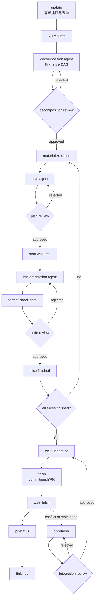

# 工作流

`sandrone` 的核心目标是把自动开发变成可追溯、可恢复、可审核的状态机。CLI 负责机械动作和门禁，Codex agent 负责分析、计划、实现和修复。

## 概念

| 概念 | 说明 |
| --- | --- |
| Workspace | 外框架目录，包含 `dev/repo`、`obsidian/`、`tools/` 和 `.sandrone/`。 |
| Target repo | 被开发的真实仓库，位于 `dev/repo`。 |
| Request | 从 issue、用户输入或内部系统提取的父需求，ID 形如 `REQ-0001`。 |
| Slice | request 拆分后的可执行小需求，ID 形如 `REQ-0001-S01`。小需求可以只有一个 slice。 |
| Gate | reviewer 或人工审批门禁，状态记录在对应阶段 Markdown 文档 frontmatter 的 `gate_*` 字段。 |
| Agent | 默认由 `tools/issue-agent.sh` 启动的 Codex 子运行，按 phase 执行 decomposition、planning、implementation 或 rebase。 |
| Reviewer | 独立结构化评审器，输出 JSON。任意 critical/high finding 都会拒绝 gate。 |

## 总流程



## Tick 与 Advance

`sdr tick` 是短主控：

1. 运行 `update`。
2. 刷新已结束 agent 和 review worker 状态。
3. 找出 eligible request/slice。
4. 在并发上限内派发 agent。
5. 对漏掉 hook 的 request 执行兜底推进；如果 review worker 已结束，会收敛 summary、gate 和下一步状态。
6. code-review 通过后停在 `wait-update-pr`。

`sdr advance --request_id <REQ>` 是单 request 推进器，通常由 agent wrapper hook 或 review worker hook 自动调用。它不抓 issue，也不扫描全部 request，只在 per-request lock 下完成当前 request 的 gate、worktree、review worker 收敛、下一 phase 派发或状态落盘。

agent wrapper 会记录 stdout、stderr、pid、exit code 和 hook log。Codex CLI 可能因为早期工具命令失败而最终返回非零；只有当 agent 最后把当前阶段文档的 Sandrone frontmatter 标记为 `agent_status: submitted`、`agent_ready_for_review: true` 时，外层才会把这次非零退出视为“产物已准备好，继续进入 review gate”。没有有效文档提交状态的非零退出仍然会 block。

## Review Worker

review gate 和 implementation agent 使用同一种异步推进模型:

1. `advance` 或 `tick` 看到 `*-submitted` 状态后，派发对应 reviewer worker，并把状态写成 `*-review-running`。
2. 每个 reviewer worker 独立运行脚本，把 detail JSON 写入 `reviews/<stage>/details/`，同时在 `.sandrone/state/jobs/<REQ>/<stage>/<attempt>/<reviewer>/` 记录 pid、exit、stdout、stderr、hook、events 和 runtime 元数据。
3. worker 退出后自动调用 `advance --request_id <REQ>`；如果 hook 漏掉，下一次 `tick` 或手动 `advance` 会兜底收敛。
4. 所有 reviewer detail 都存在后，框架生成 `summary.json`，写入阶段 Markdown frontmatter 的 gate 状态，并按结果进入下一步、退回 agent 或 block。

因此 `sdr plan-review`、`sdr code-review` 和 `sdr integration-review` 都是“派发并返回”，不会等待模型评审完整结束。要观察后台进度，使用 `sdr status`、`sdr dashboard`、`.sandrone/state/jobs/` 日志，或再次运行 `sdr advance`/`sdr tick` 收敛。

## Review 轮次

默认最大自动修复轮次：

| Gate | 默认轮次 |
| --- | --- |
| DecompositionReviewer | 5 |
| PlanReviewer | 5 |
| TestReviewer + DesignReviewer | 20 |
| IntegrationReviewer | 20 |

单次覆盖：

```bash
sdr tick --max-attempts 20
sdr advance --request_id REQ-0001 --max-attempts 20
```

超过最大轮次会标记 blocked，并写入 recovery 文档。恢复时应先读 review detail、agent journal、status 和 recovery，再运行 `resume`。

`resume` 会区分两类 blocked:

- reviewer/backend/schema/network 导致的 `gate_unavailable`：恢复到对应 `*-submitted` 状态，下一次 `tick` 直接重跑 reviewer。
- 计划、拆解、实现或集成被 reviewer 拒绝，或超过最大修复轮次：恢复到对应 `*-review-rejected` 或 `planning`，下一次 `tick` 派发 agent 修复产物。

## 并发调度

新 workspace 默认：

```toml
parallel_limit = 1
```

可以修改 `.sandrone/config.toml`，或单次运行：

```bash
sdr tick --parallel-limit 2
```

调度器会统计正在运行的 decomposition、planning、implementation、rebase agent 以及 review worker。只有剩余槽位才会派发新的 request/slice。运行中的 request 不会重复派发。

## Slice DAG

每个 request 都先进入 decomposition。拆解结果包括：

- `decomposition.json`：slice 列表、依赖、验收、冲突域、分支/worktree 计划。
- `dag.json`：机器可读 DAG。
- `<REQ> decomposition.md`：人类和 AI 可读的拆解说明。

调度器只会派发依赖已满足的 slice。当前阶段不跨 request 做冲突排序；如果多个父需求之间存在业务依赖，需要后续独立维护关系或人工调整。

## 状态含义

常见父 request 状态：

| 状态 | 含义 |
| --- | --- |
| `discovered` | 已抓取需求，尚未拆解。 |
| `decomposition-agent-running` | 正在拆解。 |
| `decomposition-submitted` | 拆解已提交，等待或正在 review。 |
| `decomposition-review-running` | DecompositionReviewer worker 正在后台运行。 |
| `decomposition-review-rejected` | 拆解被拒绝，将回到拆解 agent。 |
| `in-progress` | 已进入 slice 执行。 |
| `wait-update-pr` | 所有 slice 已通过 code-review，等待运行 `finish` 创建或更新 PR。 |
| `wait-finish` | PR 已创建/更新，等待平台合并。 |
| `finished` | `pr-status` 已确认 PR 合并。 |
| `blocked` | gate 不可用、超过轮次或外部状态无法安全继续。 |

slice 内部状态通常包括 `planning-agent-running`、`plan-submitted`、`plan-review-running`、`plan-review-rejected`、`implementation-agent-running`、`change-doc-submitted`、`code-review-running`、`code-review-rejected` 和 `slice-finished`。

## PR Refresh 支线

`wait-finish` 后，如果 PR 与 base/master 冲突或需要刷新基线：

```bash
sdr pr-refresh --request_id REQ-0001
```

`pr-refresh` 会 fetch base、尝试 rebase。冲突时记录 `pr-conflicts/attempts/NNN-rebase-conflict.md` 并派发 RebaseAgent。无论 clean rebase 还是冲突解决，都必须通过 IntegrationReviewer。通过后回到 `wait-update-pr`，需要再次运行 `finish` 推送更新后的分支。

IntegrationReviewer 重点审：

- 冲突标记是否清理干净。
- 是否保留已通过实现的语义。
- 是否保留 base/master 新代码。
- 是否只做集成适配，没有扩大需求。
- 是否处理接口、测试、配置或行为变化。
- change-doc 是否记录冲突原因、解决方式和验证。
